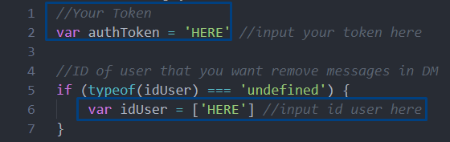
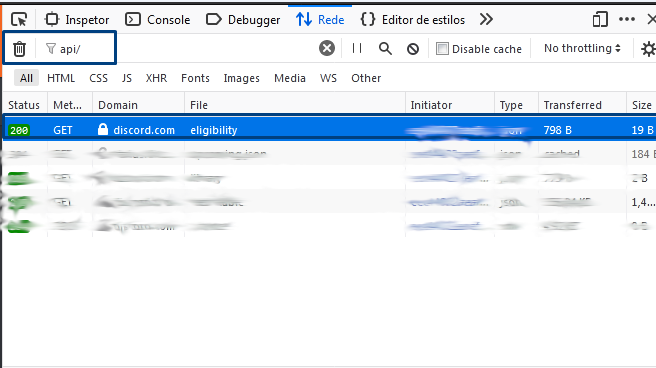
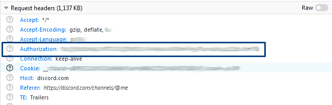

<h1>DiscordDMNuke</h1>
<h3>How to use?</h3>
<ul>
    <li style="font-size: 18px;"><strong>If you use browser</strong> - Open your Discord, press F12 and go to 'Console'. Type 'allow pasting' and paste the code after replace TOKEN and ID in code. </li>
</ul>

  
<ul>
    <li style="font-size: 18px;"><strong>If you use Discord Client</strong> - Press 'CTRL + SHIFT + I to open Developer Options in Client. After do this, go to Console and paste the code after replace TOKEN and ID in code. </li>
</ul>
 
<h3>How get my token?(browser)</h3>

    Open your discord. After this, press F5 and go to Network in Developer Options, here, type "api/" in search box and click in first option. Scroll Down to Headers and... finished, your token is here.

    "authotization" is your token!

